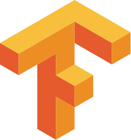
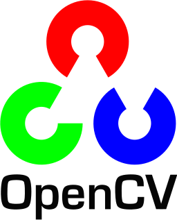

<h3 align="center">

# Hi there, I'm Akash Anandani 👋

Welcome to my GitHub profile! I'm a aspiring data scientist and problem solver with a strong foundation in Python and various data science libraries. Here’s a bit more about me and my work.

##  Snapshot of Me

-  I’m advancing my proficiency in  OpenCV, NLP, and TensorFlow.

-  Exploring AI concepts and applications , on a journey to learn AI.

-  Passionate about Machine Learning, Deep Learning, and both Web and App Development.

-  I am proficient in Python and have foundational knowledge of C programming.

-  I have experience working with Flask, Django, and FastAPI frameworks.

-  I am proficient in using libraries such as NumPy, Pandas, Matplotlib, Seaborn, Scikit-learn, TensorFlow, and Keras.
  
-  I have completed multiple internships in the data domain, including roles focused on machine learning engineering.

-  I am currently focusing on studying deep learning frameworks and exploring fields such as NLP, computer vision, and agentic AI.

-  My future goal is to learn MLOps, JavaScript, and explore mobile app development frameworks in order to effectively deploy machine learning applications end-to-end.

-  All of my projects are available at **[My Portfolio](https://kashh56.github.io/)**

##  Skills
| **#** | **Language/Tools** | **Proficiency** |
| :------------------------------------------------------------------------------------------------------------: | :----------: | :-------------------------------------------------------------------: |
|<a href="https://stackoverflow.com/">| `CTRL+C & CTRL+V`||
|<a href="https://code.visualstudio.com/">| `VsCode`||
|  | `C` ||
| | `HTML5`| |
| | `Tensorflow`| |
| | `NumPy`| |
| | `Open CV`| |
| | `CSS`| |
| | `Bootstrap`| |
||`JavaScript` | |
|<a href="https://git-scm.com/">| `Git`||
| | `Python`| |
||`Django`||
| | `ReactJS` | |

##  Connect with me

 

## 🌟 What I’m Looking For

I’m always eager to collaborate on projects, contribute to open source, and learn new things. If you have an interesting project or idea, let’s connect!

---

Thanks for visiting my profile! Feel free to explore my repositories and reach out if you have any questions or want to collaborate.
